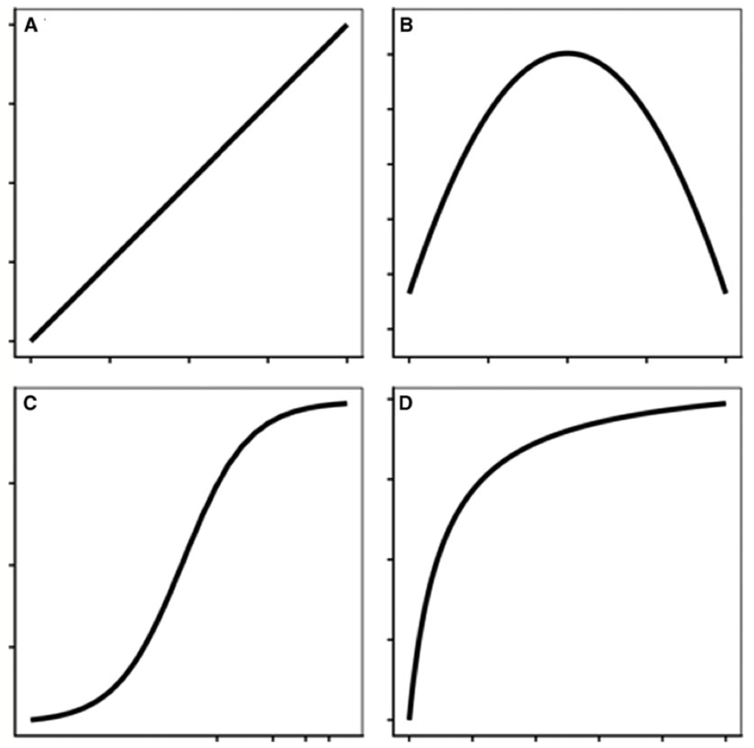
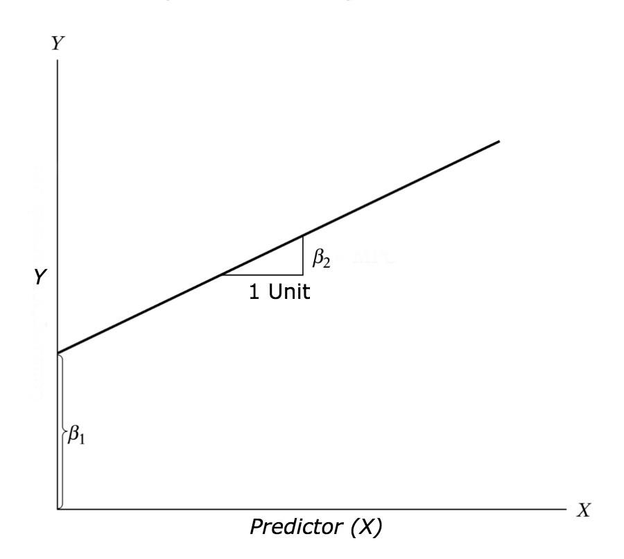

```{r include=FALSE}
library(tidyverse)
library(moderndive)
library(lme4)
library(lmerTest)
library(ggpubr)
library(nortest)
library(emmeans)
library(bestNormalize)
library(CGPfunctions)
```

## Common regression lines

- What does these curves is telling us?

```{r, echo=FALSE, fig.cap="", out.width = '50%', fig.align="center", fig.retina = 2, fig.pos='h'}

```

## Types of regression lines

- Nested: Models that are a particular case of each other and have identical terms, whereas one must have at least one additional term (e.g. three- and four-parameter log-logistic models)

- Non-nested: Models with different structure and parameters, such as an exponential decay and a rectangular hyperbola model.

## Linear regression

- Linear regression is used to predict the value of an outcome variable Y based on one or more input predictor variables X. 

- The aim is to establish a linear relationship (a mathematical formula) between the predictor variable(s) and the response variable, so that, we can use this formula to estimate the value of the response Y, when only the predictors (Xs) values are known.

## Objective

- The aim of linear regression is to model a continuous variable Y as a mathematical function of one or more X variable(s), so that we can use this regression model to predict the Y when only the X is known.

  $Y=\beta \tiny 1 +\beta \tiny 2 X + \epsilon$

- where, $\beta \tiny 1$ is the intercept and $\beta \tiny 2$ is the slope. Collectively, they are called regression coefficients. $\epsilon$ is the error term, the part of Y the regression model is unable to explain.

## Linear model

```{r, echo=FALSE, fig.cap="", out.width = '60%', fig.align="center", fig.retina = 2, fig.pos='h'}

```

## Example

\scriptsize
```{r}
sample_n(mpg, size=8)
```

## Data Visualization

- Scatter plot

```{r, fig.align="center", out.width='60%'}
ggplot(mpg, aes(x=cty, y=hwy)) + geom_point()
```

## Data Visualization

- BoxPlot / Check for outliers

\scriptsize
```{r, out.width = '50%', fig.align="center"}
par(mfrow=c(1, 2))  # divide graph area in 2 columns
boxplot(mpg$hwy, main="Highway miles", sub=paste("Outlier rows: ",
     boxplot.stats(mpg$hwy)$out))  # box plot for 'speed'
boxplot(mpg$cty, main="City miles", sub=paste("Outlier rows: ",
  boxplot.stats(mpg$hwy)$out))  # box plot for 'distance'
```

## Density plot

- Use package *ggpubr*

::: columns

:::: column

- Highway

\scriptsize
```{r, out.width = '70%', fig.align='center'}
ggdensity(mpg$hwy, fill="blue")
```

::::

:::: column

- City

\scriptsize
```{r, out.width = '70%', fig.align='center'}
ggdensity(mpg$cty, fill="blue")
```


::::

:::


## Pearson test of normality

- Use package *nortest*

\scriptsize
```{r echo=TRUE}
pearson.test(mpg$hwy)
pearson.test(mpg$cty)
```

## Data transformation

```{r, warning=FALSE}
# library MASS and bestNormalize
Hmil <- bestNormalize(mpg$hwy)
Cmil <- bestNormalize(mpg$cty)
```

- Run **Hmil** and **Cmil** to investigate whether the transformation help normalizing mpg data. 

## Modeling linear regression

```{r}
#package lme4 and lmerTest
model <- lmer(hwy ~ cty + (1|year), data=mpg)
```

\tiny
```{r}
summary(model)
```

## ANOVA

\scriptsize
```{r}
anova(model)
```


## Figure

```{r, out.width = '70%', fig.align='center'}
ggplot(mpg, aes(x=cty, y=hwy)) + geom_smooth(method="lm") + 
  ylim(0, 50) + xlim(0,40) + geom_point(aes(color=hwy))
```


## ANCOVA

- The analysis of covariance (ANCOVA) is used to compare two or more regression lines by testing the effect of a categorical factor on a dependent variable (y-var) while controlling for the effect of a continuous co-variable (x-var)

- Dataset Iris

\scriptsize
```{r}
#Package tidyverse
sample_n(iris, size=5) 
```

## Plot raw data

- I am interesting in the sepal length and sepal width relationship.

```{r, out.width='65%', fig.align='center'}
ggplot(iris, aes(x=Sepal.Width, y=Sepal.Length, color=Species)) + 
   geom_point() 
```

## Checking normality

- Use package *ggpubr*

::: columns

:::: column

- Sepal length

\scriptsize
```{r, out.width = '70%', fig.align='center'}
ggdensity(iris$Sepal.Length, fill="blue")
```

::::

:::: column

- Sepal width

\scriptsize
```{r, out.width = '70%', fig.align='center'}
ggdensity(iris$Sepal.Width, fill="blue")
```


::::

:::


## Modeling 

- Note I use *lm* function because there is no random effects in my dataset.

\tiny
```{r}
data <- iris
Model <- lm(Sepal.Length~Sepal.Width * Species, data=data)
summary(Model)
```


## ANOVA

\scriptsize
```{r}
anova(Model)
```
\normalsize
- What is ANOVA telling us?


```{r eval=FALSE, warning=FALSE, include=FALSE, out.width='65%'}
#library(CGPfunctions)
new<-Plot2WayANOVA(Sepal.Length ~ Sepal.Width * Species, 
              dataframe =iris, confidence=.95, 
    plottype = "line", PlotSave = FALSE)
new$ANOVATable
```


## Extracting slopes

- You may want to compare slopes

```{r}
m.lst <- emtrends(Model, "Species", var="Sepal.Width")
m.lst # list the slope values
```
## Comparing slopes

\scriptsize
```{r}
pairs(m.lst)
```


## Plotting Model

```{r, out.width='65%', fig.align='center'}
ggplot(iris, aes(x=Sepal.Width, y=Sepal.Length, 
                 color=Species)) + 
   geom_point() + geom_smooth(method="lm")
```


## Fitting a more parsimonious model

- What is the difference between the Model (previous model) and Model2?

\scriptsize
```{r}
Model2 <- lm(Sepal.Length ~ Sepal.Width + Species, data=iris) 
summary(Model2)
```


## ANOVA

\scriptsize
```{r}
anova(Model2) 
```


## ANOVA Test 

- Comparison between Model and Model2

\scriptsize
```{r}
anova(Model, Model2, test="F")
```

\normalsize

- The *anova()* command clearly shows that removing the interaction does not affect the fit of the model (F=0.4064, *P*-value=0.6668)


## Extracting slopes

```{r}
m.lst <- emtrends(Model2, "Species", var="Sepal.Width")
m.lst
```


## Fitting a more parsimonious model

- What is the difference between the Model2 (previous model) and Model3?

\tiny
```{r}
Model3 <- lm(Sepal.Length~Sepal.Width, data=iris)
summary(Model3)
```


## ANOVA test

```{r}
anova(Model2, Model3)
```

\normalsize

- The *anova()* command clearly shows that removing species strongly affect the fit of the model (F=189.65 , *P*-value=< 2.2e-16)

## Fit the Model2 


- Creating new data frames to fit Model 2 in a ggplot2 figure.

```{r}
newdata <- expand.grid(Sepal.Width=seq(1.8, 5, length=5))
newdata1 <- data.frame(Species =c("versicolor"), newdata)
newdata2 <- data.frame(Species =c("setosa"), newdata)
newdata3 <- data.frame(Species =c("virginica"), newdata)

nd=rbind(newdata1, newdata2, newdata3)

pm <- predict(Model2, newdata=nd, interval="confidence")

nd$p <- pm[,1]
nd$pmin <- pm[,2] # conf interval
nd$pmax <- pm[,3] # conf interval
```

## Figure

```{r, out.width='70%', fig.align='center'}
ggplot(data = iris, aes(x = Sepal.Width, y = Sepal.Length, color=Species)) +
  geom_point() +
  geom_line(data=nd, aes(x=Sepal.Width, y=p)) + ylim(0,9)
```


