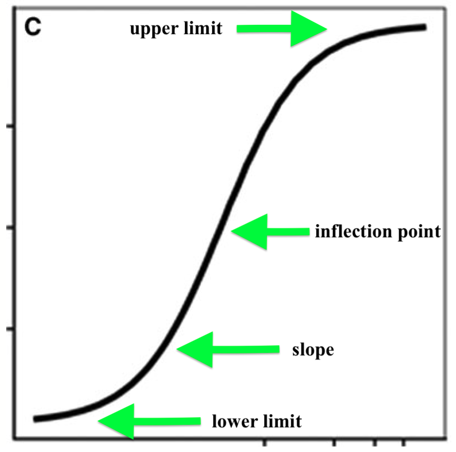

```{r include=FALSE}
library(tidyverse)
library(drc)
```

## Sigmoid curves

- It is a nonlinear regression
- It is a mathematical function having a characteristic "S"-shaped curve or sigmoid curve. 
- It is a logistic function (*e* = the natural logarithm base (also known as Euler's number) 

## Curve and Parameters

```{r, echo=FALSE, fig.cap="", out.width = '60%', fig.align="center", fig.retina = 2, fig.pos='h'}

```

## Example

- [A study performed to compare waterhemp R (resistant) and S (susceptble) populations to HPPD-inhibitor herbicides](https://www.frontiersin.org/articles/10.3389/fpls.2018.00060/full)


```{r}
data <- read_csv("Dose.csv")
```

## Plot the data

\scriptsize
```{r, out.width='70%', fig.align='center'}
ggplot(data, aes(x=rate, y=injury, color=biotypes)) + 
  geom_point()
```


## Model

- Example of \textcolor{red}{four-parameter log-logistic}:

Equation: $$Y= c + \frac{d - c}{(1 + exp[b(logx - loge)]} $$

where *Y* is response variable (%), *x* is the x-values (treatment. The parameter *c* is the lower limit, *d* is the upper limit (asymptote), *b* is the slope and the parameter *e* is the ED50 (effective *x* that causes 50% reduction in *Y*). 


- There are multiple variations in sigmoid models. See [Knezevic et al. (2007)](https://www.cambridge.org/core/journals/weed-technology/article/utilizing-r-software-package-for-doseresponse-studies-the-concept-and-data-analysis/E3607D41C953BEEEB7A8B2F9D60F1C4B)


## Function

- Package [drc](https://cran.r-project.org/web/packages/drc/drc.pdf) makes easier to work with sigmoid curves

- Use package \textcolor{red}{drc} and \textcolor{purple}{tidyverse}

- Function \textcolor{blue}{drm}

\tiny
```{r, warning=FALSE}
model <- drm(injury ~ rate, biotypes, fct = l4(), data=data)
summary(model)
```

## Model selection

- Model selection with \textcolor{orange}{anova} function
\scriptsize
```{r, warning=FALSE}
model2 <- drm(injury ~ rate, biotypes, fct = l3(), data=data)
```
\scriptsize
```{r}
anova(model, model2)
```


## Model selection

- Model selection with \textcolor{blue}{mselect} function

\scriptsize
```{r, warning=FALSE}
mselect(model, list(l3(), W2.3(), W1.3(), W1.4(), W2.4()), 
        nested = TRUE,
sorted = c("IC", "Res var", "Lack of fit", "no"), 
linreg = TRUE, icfct = AIC)
```

## Model is selected

- The selected model is the log logistic **W1.3** (3-parameters) 

\scriptsize
```{r, warinig=FALSE}
model2 <- drm(injury ~ rate, biotypes, fct = W1.3(fixed=c(NA,NA,NA), 
names=c("slope", "upper", "infpoint")), data=data)
```

\tiny
```{r, warinig=FALSE}
summary(model2)
```


## Fixing the modeling problem

- There is a problem at my model. Let's fixed!

\tiny
```{r, warinig=FALSE}
model3 <- drm(injury ~ rate, biotypes, fct = W1.3(fixed=c(NA, 100, NA), 
names=c("slope", "upper", "infpoint")), data=data)
```


\tiny
```{r, warinig=FALSE}
summary(model3)

```


## Post-hoc analysis

- Usually researchers are looking for the the dose that causes 50% or 90% injury (e.g., control or biomass reduction) in the weed biotypes.

- The values is estimated with **ED** function

\scriptsize
```{r}
ED(model3, c(50,90), type="absolute", interval = "delta")
```


## Test statistics

- The **EDcomp** function provides a pairwise t-test with the selected **ED** values

\scriptsize
```{r}
EDcomp(model3, c(50,50), type="absolute")
```

## Comparing parameters

\scriptsize
```{r}
compParm(model3, "slope", "-")
```


\scriptsize
```{r}
compParm(model3, "infpoint", "-")
```

## Confidence Intervals for model parameters

```{r}
confint(model3)
```


## Figure


```{r, warning=FALSE}
plot(model3, col=c(1,2,3))
```


## Figure using ggplot2

\scriptsize
```{r, warning=FALSE}
# new dose levels as support for the line
newdata <- expand.grid(rate=exp(seq(log(0.5), log(1680), length=1680)))
newdata1 <- data.frame(biotypes =c("R"), newdata)
newdata2 <- data.frame(biotypes =c("S"), newdata)
newdata3 <- data.frame(biotypes =c("RS/F1-5"), newdata)  

nd <- rbind(newdata1, newdata2, newdata3)

# new data with predictions
pm <- predict(model3, newdata=nd, interval="confidence")

# new data with predictions
nd$p <- pm[,1] 
nd$pmin <- pm[,2] 
nd$pmax <- pm[,3]

# need to shift conc == 0 a bit up, otherwise there are problems with coord_trans 
data$rate0 <- data$rate
data$rate0[data$rate0 == 0] <- 0.5
```

## Figure ggplot2

\scriptsize
```{r, out.width='60%', fig.align='center', warning=FALSE}
ggplot(data, aes(x=rate0, y=injury, color=biotypes)) + #geom_point() +
  geom_ribbon(data=nd, aes(x=rate, y=p, ymin=pmin, ymax=pmax), alpha=0.2) + 
  geom_line(data=nd, aes(x=rate, y=p)) + theme_bw() +
coord_trans(x="log")
```


## Other uses


- [Critical time for weed removal](https://www.cambridge.org/core/journals/weed-science/article/critical-period-for-weed-control-revisiting-data-analysis/F2840F1A843DA1918DC5DFDB90472525)

- [Weed emergence](https://www.cambridge.org/core/journals/weed-science/article/predicting-emergence-of-23-summer-annual-weed-species/A18669CDB9459D5A936B2EC51EA99ECD)


